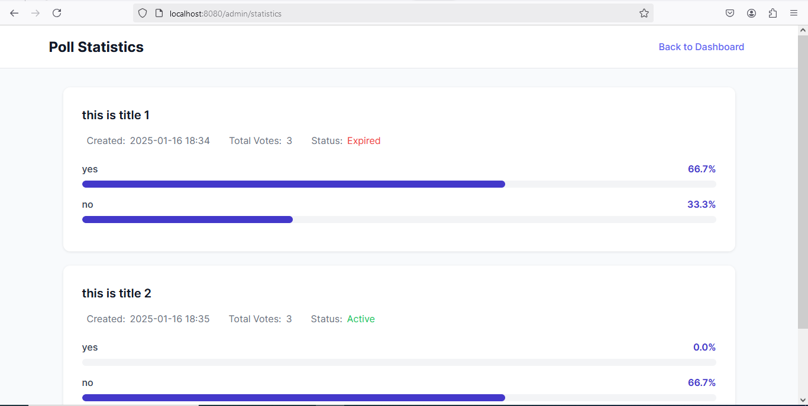

# Polling System
A robust web-based polling application built with Spring Boot that allows users to create, manage, and participate in time-limited polls with real-time statistics.

## Features

**User Authentication & Authorization**

- Secure user registration and login
- Role-based access control (Admin/User)
- Password encryption using BCrypt

**Poll Management**

- Create polls with multiple options
- Set poll duration in minutes
- Automatic poll expiration
- View active and expired polls

**Voting System**
- One vote per user per poll
- Vote status tracking for each user

**Statistics & Analytics**
- Detailed poll statistics
- Vote percentage calculation
- User participation tracking
- Visual representation of poll results

**Technology Stack**
- Java 21
- Spring Boot 3.4.1
- Spring Security
- Spring Data JPA
- MySQL
- Docker
- Thymeleaf
- CSS

